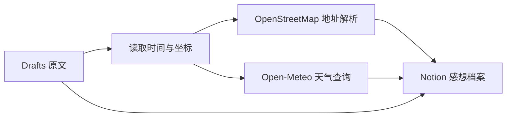

# Drafts → Notion Journal

[中文](README.md) | [English](README_EN.md)

把 Drafts 中的随手记录完整归档到 Notion，并自动补充创建时间、地点和当时天气。

同一个 Draft 重复执行时会更新原记录，不会制造重复页面。

## 功能

- 保留 Draft 完整原文、创建时间和修改时间
- 同步 Drafts 标签、UUID 和返回 Drafts 的链接
- 将创建坐标转换成中文地址
- 保存原始经纬度和 Apple 地图链接
- 查询最接近创建时刻的天气
- 支持 iPhone、iPad 和 Mac；可配合 Apple Watch 快速记录
- 使用 Draft UUID 幂等更新
- 首次运行配置 Notion 数据库，源码不保存个人数据库 ID

## 工作流程

## 快速开始

1. 按照 [Notion 数据库配置](docs/notion-schema.md)创建数据库及字段。
2. 在 Drafts 新建 Action，并添加一个 `Script` 步骤。
3. 将 [src/drafts-notion-sync.js](src/drafts-notion-sync.js) 完整粘贴到 Script。
4. 保持 `Allow asynchronous execution` 关闭。
5. 打开一篇 Draft，运行 Action。
6. 首次运行时授权 Notion，然后粘贴目标数据库的完整页面链接。

详细步骤见 [安装指南](docs/setup.md)。

## 配合 Apple Watch 使用

如果你有 Apple Watch，可以直接在手表上的 Drafts 里用语音或键盘快速记录。Draft
通过 iCloud 同步到 iPhone 后，再在手机 Drafts 中运行 `同步感想到 Notion`，即可
归档到 Notion。

推荐流程：

1. 在 Apple Watch 打开 Drafts，记录当下想法。
2. 等待这篇 Draft 出现在 iPhone 的 Drafts 中。
3. 在 iPhone 打开该 Draft，运行 `同步感想到 Notion`。
4. 在 Notion 的“感想档案”中查看结果。

同步脚本不需要在 Apple Watch 上运行。地点和天气依赖 Draft 本身是否保存了创建坐标；
如果手表记录没有携带坐标，正文和时间仍会正常同步，但地点与天气会留空。

## Notion 中保存的内容

| 类别 | 字段 |
| --- | --- |
| 原文 | 标题、完整正文、标签 |
| 时间 | 记录时间、修改时间 |
| 来源 | Draft UUID、Draft 链接、来源 |
| 地点 | 地点、纬度、经度、地图、有定位 |
| 天气 | 天气、气温、体感温度、湿度、降水量、风速 |
| 状态 | 同步状态 |

## 隐私

- Notion 授权由 Drafts 内置 OAuth 完成，脚本不保存 Notion Token。
- 数据库链接通过 Drafts Credential 保存在设备中，不会写入源码。
- 地址解析会向 OpenStreetMap Nominatim 发送经纬度。
- 天气查询会向 Open-Meteo 发送经纬度和 Draft 创建日期。
- 不建议批量高频同步，以遵守公共服务的合理使用要求。

更多信息见 [隐私说明](docs/privacy.md)。

## 数据来源

- 地址数据：[OpenStreetMap contributors](https://www.openstreetmap.org/copyright)
- 反向地理编码：[Nominatim](https://nominatim.org/)
- 天气数据：[Open-Meteo](https://open-meteo.com/)
- Drafts 脚本环境：[Drafts Script Reference](https://scripting.getdrafts.com/)

## 许可证

[MIT](LICENSE)
