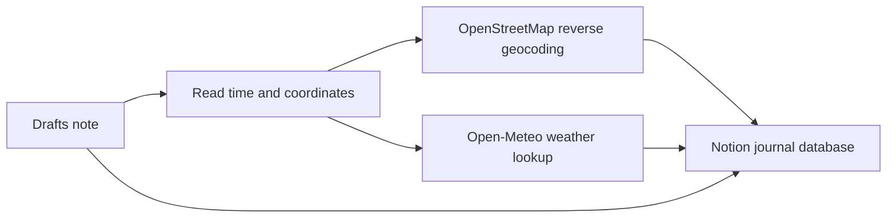

# Drafts → Notion Journal

[中文](README.md) | [English](README_EN.md)

Archive your Drafts notes in Notion while preserving the original text and automatically enriching each entry with its creation time, location, and historical weather.

Running the action again for the same Draft updates the existing Notion page instead of creating a duplicate.

## Features

- Preserves the full Draft text, creation time, and modification time
- Syncs Drafts tags, UUID, and a link back to Drafts
- Converts creation coordinates into a readable address
- Keeps the original latitude, longitude, and an Apple Maps link
- Retrieves hourly weather closest to the Draft's creation time
- Supports iPhone, iPad, and Mac, with an Apple Watch capture workflow
- Uses the Draft UUID for idempotent create-or-update behavior
- Stores the Notion database configuration in Drafts Credential, not in source code

## How It Works

## Quick Start

1. Create the required properties using the [Notion database schema](docs/notion-schema-en.md).
2. Create a new Action in Drafts and add a `Script` step.
3. Paste the complete contents of [src/drafts-notion-sync.js](src/drafts-notion-sync.js).
4. Leave `Allow asynchronous execution` turned off.
5. Open a Draft and run the Action.
6. On first use, authorize Notion and paste the full URL of your target database.

See the [setup guide](docs/setup-en.md) for detailed instructions.

## Apple Watch Workflow

If you use Apple Watch, you can quickly capture a note in the Drafts watch app using dictation or the keyboard. After the Draft syncs to your iPhone through iCloud, open it in Drafts on the phone and run the Notion sync action.

Recommended workflow:

1. Capture a thought in Drafts on Apple Watch.
2. Wait for the Draft to appear in Drafts on iPhone.
3. Open it on iPhone and run `同步感想到 Notion`.
4. View the archived entry in your Notion database.

The script does not need to run on Apple Watch. Location and weather require the Draft itself to contain creation coordinates. If no coordinates were recorded, the original text and timestamps still sync normally.

## Data Stored in Notion

| Category | Properties |
| --- | --- |
| Content | Title, full text, tags |
| Time | Created time, modified time |
| Source | Draft UUID, Draft link, source |
| Location | Address, latitude, longitude, map link, location flag |
| Weather | Conditions, temperature, apparent temperature, humidity, precipitation, wind speed |
| Status | Sync status |

## Privacy

- Notion authorization uses Drafts' built-in OAuth support. The script does not store the Notion token.
- The database URL is stored locally through Drafts Credential and is not embedded in source code.
- Reverse geocoding sends coordinates to OpenStreetMap Nominatim.
- Weather lookup sends coordinates and the Draft creation date to Open-Meteo.
- This project is intended for personal, low-frequency use.

See the complete [privacy notes](docs/privacy-en.md).

## Data Providers

- Address data: [OpenStreetMap contributors](https://www.openstreetmap.org/copyright)
- Reverse geocoding: [Nominatim](https://nominatim.org/)
- Weather data: [Open-Meteo](https://open-meteo.com/)
- Script runtime: [Drafts Script Reference](https://scripting.getdrafts.com/)

## License

[MIT](LICENSE)
